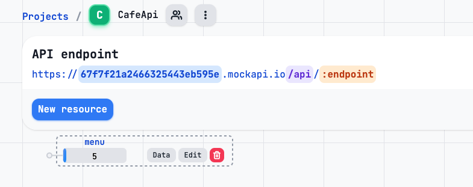
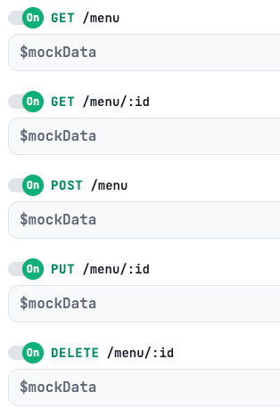
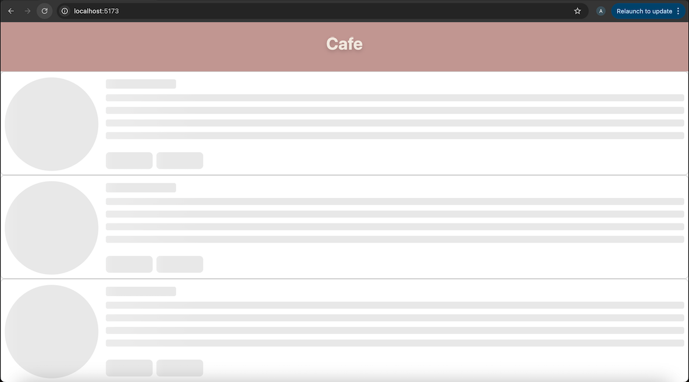
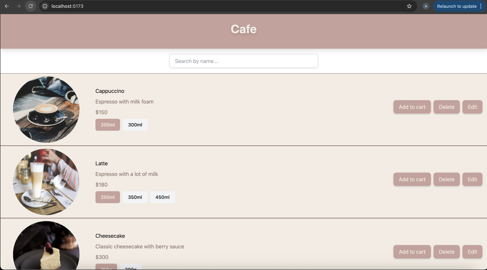
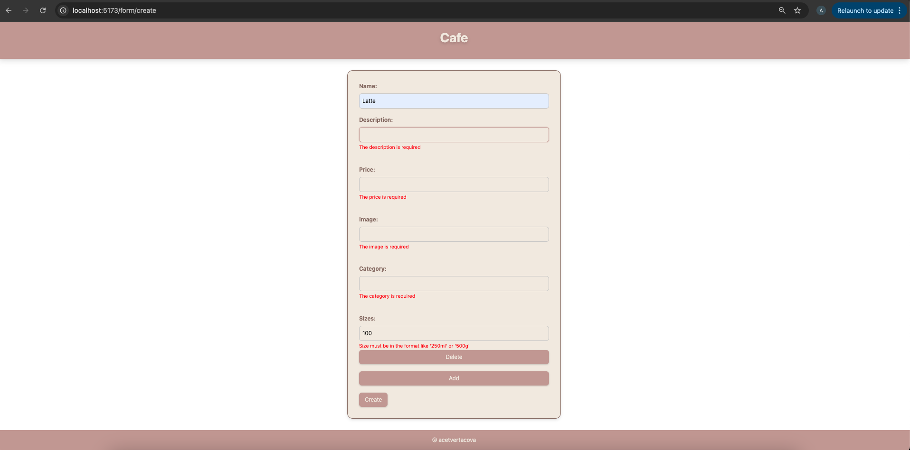
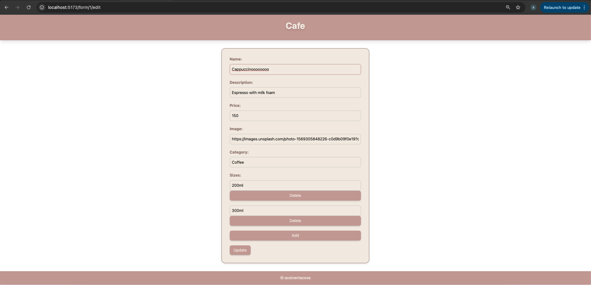
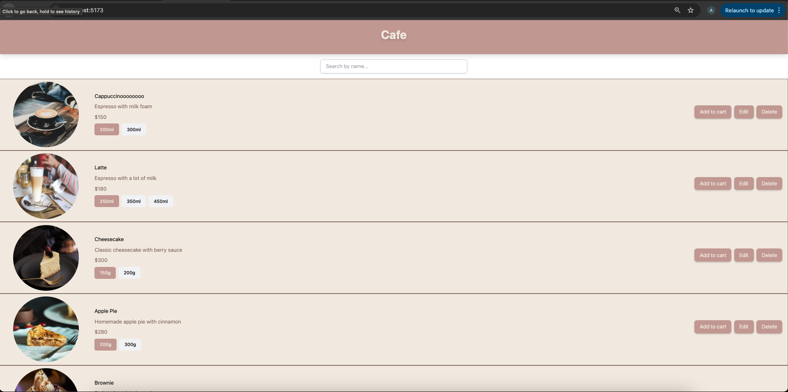

# Lab №5: Form, Validation and API

## Installation and Project Launch Instructions

### Setting up the working environment

1. Download and install the latest or stable version of **Node.js**.

2. Check the installation of **Node.js** and **NPM** by running the following commands in the terminal:

    `node -v`
    
    `npm -v`

3. Navigate to the project folder and start the development server with `npm run dev`.

## Lab's Description

Master creating forms in React, learning to manage user input and perform validation. Gain skills in interacting with REST APIs: sending and receiving data from a server. Transition from using local data to working with an external API.

## Project Structure

       src/
        │── assets/
        │── layouts/
        │   │── MainLayout.jsx
        │── components/
        │   │── Footer.jsx
        │   │── Header.jsx
        │   │── MenuCard.jsx
        │   │── Menu.jsx
        │   │── MenuCardSkeleton.jsx
        │   │── Search.jsx
        │   │── MenuForm.jsx
        │── pages/
        │   │── AboutPage.jsx
        |   │── CartPage.jsx
        |   │── NotFoundPage.jsx
        |   │── ProductPage.jsx
        |── validation/
        │   │── menu.schema.js
        |── api/
        │   │── menu/
        |   │   │── menu.js
        |   |── api.js
        │── App.jsx
        │── main.jsx
        |── ...

## Usage Examples

API Service for Menu Management:

This module implements functions to interact with a REST API hosted on MockAPI. These functions are used to fetch, create, update, and delete menu items in the application.

 - `axios` — for sending HTTP requests
 - `MockAPI` — used as a mock backend to simulate real API interactions

 

🌐 API Configuration

    ```js 
    const api = axios.create({
    baseURL: "https://67f7f21a2466325443eb595e.mockapi.io/api",
    });
    ```

API Methods



src/api/menu/menu.js

```js
import api from '../api';

export const getMenu = async () => {
  const response = await api.get('/menu'); //Retrieves a list of all menu items (GET /menu)
  return response.data;
};

export const getMenuItemById = async (id) => {
  const response = await api.get(`/menu/${id}`); //Retrieves a single menu item by ID (GET /menu/:id)
  return response.data;
};

export const createMenuItem = async (menuItem) => {
  const response = await api.post('/menu', menuItem); //Creates a new menu item (POST /menu)

  return response.data;
};

export const updateMenuItem = async (id, menuItem) => {
  const response = await api.put(`/menu/${id}`, menuItem); //Updates an existing menu item (PUT /menu/:id)
  return response.data;
};

export const deleteMenuItem = async (id) => {
  await api.delete(`/menu/${id}`); //Deletes a menu item by ID (DELETE /menu/:id)
};
```

1. **Fetchig Data from API**

The `Menu` component is responsible for fetching menu items from an external API (menuApi.getMenu()). When the component mounts, it triggers a request to retrieve the menu data.

State Management:

    - menu: Stores the full list of menu items.
    - filteredMenu: Stores the filtered list based on user input (search).
    - loading: Boolean flag to show loading state.
    - error: Stores any error message if the API request fails.

```jsx 
    const [menu, setMenu] = useState([]);
    const [filteredMenu, setFilteredMenu] = useState([]);
    const [loading, setLoading] = useState(false);
    const [error, setError] = useState(null);
```

*`useEffect` Hook:*

The useEffect hook triggers the API call when the component mounts. It sets the loading state to true, fetches the data using `menuApi.getMenu()`, and sets the data to the state variables menu and filteredMenu. If an error occurs, it sets the error state.

*Error Handling:*

If there is an error while fetching data (e.g., network failure), it is caught in a `try...catch` block and displayed to the user.

```jsx
useEffect(() => {
        setLoading(true);
        setError(null);

        const fetchMenu = async () => {
            try {
                const data = await menuApi.getMenu();
                setMenu(data);
                setFilteredMenu(data);
            } catch (error) {
                console.error('An error loading:', error);
                setError(error.message || 'Failed to load menu. Please try again later.');
            } finally {
                setLoading(false);
            }
        };
        fetchMenu();
    }, []);
```
*Loading State:*

While the data is being fetched, a loading indicator is shown using the `<MenuCardSkeleton />` component. This provides visual feedback to the user, simulating the layout of real content.



*Displaying Data:*

Once the data is successfully retrieved, it’s stored in a local state variable. The component maps over the data and renders a <MenuCard /> for each item in the list. Each card displays the menu item’s image, name, description, price, and available sizes.



```jsx
return (
        <div>
            {loading && <MenuCardSkeleton cards={6} />}
            {error && <p>Error: {error}</p>}

            <Search onSearch={handleSearch} />
            {filteredMenu.map((item) => (
                <MenuCard key={item.id} menuItem={item} />
            ))}
        </div>
    )
```

2. **Creating Data and Form Validation:**

The `POST` method is used to send new product data from the form to the server. When it happens: When there is no id in the URL (meaning the form is used to create a new item, not update).

```jsx
const onSubmit = async (data) => {
    try {
      if (id) {
        await menuApi.updateMenuItem(id, data);
      } else {
        await menuApi.createMenuItem(data); // <--- This is the POST request
      }
      navigate('/');
    } catch (error) {
      console.error('An error loading:', error);
      setError(error.message || 'Failed to load menu. Please try again later.');
    }
  };
```
*useForm*

`useForm` is a custom hook for managing forms with ease. The hook is used to handle form state, input registration, and validation in a React component.

    ```jsx
    const {
    register, //Used to connect input fields to the form system
    handleSubmit, //The function that handles the form submission
    control, //Used when working dynamic fields(sizes)
    reset, //Used to fill the form with data, e.g., when editing an existing item
    formState: { errors }, //This contains validation errors for each input.
    } = useForm({
    resolver: yupResolver(schema), //Connects Yup validation schema to the form
    mode: "onChange", //Validation runs as the user types or edits each field
    });
    ```

*Yup*

Yup is a JavaScript schema builder for value parsing and validation. 

This creates a Yup object schema, and `.required()` ensures the whole form object must exist.

```js
    const schema = yup.object({
    ...
    }).required();
```

Example of validation for `description`:
```js
description: yup
  .string() //Must be a string
  .required("The description is required") //cannot be empty
  .trim() //spaces will be removed
  //Must be between 10 and 100 characters
  .min(10, "The description should consist of at least 10 symbols")
  .max(100, "The description should consist maximum of 100 symbols"),
```

The `array` validation:

```js
    sizes: yup
    .array()
    .of(
        yup
        .string() //Must be an array of strings
        .required("Size is required") //Each string must bee required
        .matches("^([0-9]{2,4})(ml|g)$", "Size must be in the format like '250ml' or '500g'") //Match pattern like 250ml or 500g using a RegEx
    )
    .min(1, "At least one size is required"),
```

*Dynamic field:*

- `useFieldArray` - manages this array and returns:
    - `fields` - an array of objects representing the current fields of the form
    - `append()` - a function for adding a new field. It takes an argument matching the structure of a single item in the array specified by name. For example, I am working with a simple array of values (sizes: [""]), so I can pass plain string: `append("200ml")`. This adds a new item to the `sizes` array, and the form will automatically display a new input field for it.
    - `remove(index)` - a function to remove a field by its index

- If I set `name: "sizes"`, then useFieldArray will manage the formData.sizes array — meaning the array values will be stored under this key. 
- Input fields are rendered using data from the fields array, and each field has a `unique key (field.id)`
- When the form is submitted using `handleSubmit`, all values from the sizes array are automatically collected into an object and passed to onSubmit.

```jsx
const { fields, append, remove } = useFieldArray({
    control,
    name: "sizes",
  });
```

```jsx
    <div className="form-group">
        <label>Sizes:</label>
        {fields.map((field, index) => (
          <div key={field.id}>
            <input className="form-input" {...register(`sizes.${index}`)} defaultValue={field.value} />
            {errors.sizes && errors.sizes[index] && (
              <p className="form-error">{errors.sizes[index].message}</p>
            )}
            <button className="button" type="button" onClick={() => remove(index)}>Delete</button>
          </div>
        ))}
        <button className="button" type="button" onClick={() => append("")}>Add</button>
    </div>
```



**Editing Menu Item:**

The `PUT` is used to update an existing resource.

```jsx
    const { id } = useParams(); //Retrieving the id of the item from the URL using React Router’s useParams
```

*Fetching Existing Data for Prefilling:*

```jsx
useEffect(() => {
  setError(null);
  if (id) { //When the component loads, if id is present, it calls the backend to get the existing menu item
    const fetchMenuItem = async () => {
      const data = await menuApi.getMenuItemById(id);
      reset({ //reset(...) pre-fills the form with the fetched data for editing
        name: data.name,
        description: data.description,
        price: data.price,
        image: data.image,
        category: data.category,
        sizes: data.sizes || [],
      });
    };
    fetchMenuItem();
  }
}, [id, reset]);
```



In the `MenuCard` component, the `Edit` button uses React Router's useNavigate to redirect the user to the edit form page by calling:

```jsx
<button className="button" onClick={() => navigate(`form/${menuItem.id}/edit`)}>Edit</button>
```

This navigates to a route like `/form/3/edit`, where the `MenuForm` component fetches the existing item data and displays it for editing.

```jsx
const onSubmit = async (data) => {
  try {
    if (id) {
      await menuApi.updateMenuItem(id, data); // <-- PUT for new items
    } else {
      await menuApi.createMenuItem(data);
    }
    navigate('/'); //Redirect the user to the home page after a successful form submission
  } catch (error) {
    console.error('An error loading:', error);
    setError(error.message || 'Failed to load menu. Please try again later.');
  }
};
```



**Deleting Menu Item:**

I delete a menu item by passing the `handleDelete` function as a prop (onDelete) to the MenuCard component.

```jsx
{filteredMenu.map((item) => (
    <MenuCard key={item.id} menuItem={item} onDelete={handleDelete} />
    ))}
```

Inside MenuCard, clicking the Delete button triggers `onDelete(menuItem.id)`, which calls handleDelete with the item's ID, deletes it via the API `(menuApi.deleteMenuItem)`, and removes it from the UI by updating the filteredMenu state.

```jsx
    <button className="button" onClick={() => onDelete(menuItem.id)}>Delete</button>
```

```jsx
const handleDelete = async (id) => {
        try {
            await menuApi.deleteMenuItem(id);
            setFilteredMenu(menu.filter(item => item.id !== id));
        } catch (error) {
            console.error("On delete error", error);
        }
    };
```

## ❔The Control Questions

1. What is client-side validation and its role in web-apps?

Client-side validation is an initial check and an important feature of good user experience; by catching invalid data on the client-side, the user can fix it straight away. If it gets to the server and is then rejected, a noticeable delay is caused by a round trip to the server and then back to the client-side to tell the user to fix their data.

Role in Web Apps:
    - Improved User Experience
    - Reduced Server Load
    - Enhanced Security (Initial Layer)

2. What is API and how does it work? 

An API is a set of rules that allow different software applications to communicate with each other. Think of it like a bridge that connects two systems and lets them share data or services.

To make this clearer, let’s use an example:

 - Imagine you’re at a restaurant. The waiter (API) takes your order (request), brings it to the chef (server), and then brings the food back to you (response).

 - Similarly, when you search for a course on a website, you send a request through an API, which then checks the database and sends the result back to you.

APIs work in a simple step-by-step process:

 - `Request`: A client (user) sends a request through the API’s URI (Uniform Resource Identifier).
 - `Processing`: The API forwards the request to the server.
 - `Response`: The server processes the request and sends the response back to the API.
 - `Delivery`: The API returns the server’s response to the client.

3. What is REST API? What is difference between REST API and API?

REST (Representational State Transfer) is a simple, flexible API *architecture* that uses HTTP methods (GET, POST, PUT, DELETE) for communication.


|**Feature**      | **API**                                                                | **REST API**                              |
|-----------------|------------------------------------------------------------------------|-------------------------------------------|
|**Definition**   |A set of rulesthat define how software components interact w/ each other| An architectural style for designing APIs |
|**Data formats** |                           JSON, XML, and YAML                          |           Primarily uses JSON             |
|**Statelessness**|                        Can be stateful or stateless                    |                 Stateless                 |


4. How to organize data fetching from the server when the component mounts?

Using `useEffect` and Fetch API or axios.

 - `Fetch API` (built into the browser): a modern standard for making requests. The fetch() method returns a Promise, which allows you to get the result of the request once it arrives. 
 - `Axios` (external library): a popular library that simplifies working with requests. Axios provides convenient methods (axios.get(...), axios.post(...), etc.) that return a Promise, and it automatically handles some details (for example, it converts a JSON response into an object).

## Source List 

1. [Git Course](https://github.com/MSU-Courses/development-of-web-application-with-react/blob/main/07_Routing/07_02_Routing_In_React.md)
2. [API](https://www.geeksforgeeks.org/what-is-an-api/)
3. [REST API](https://medium.com/@raheelarifkhans/what-is-the-difference-between-rest-api-vs-api-98ab7e6580f4)
4. [useForm](https://react-hook-form.com/docs/useform)
5. [Yup](https://www.npmjs.com/package/yup/v/1.0.0-alpha.3)
6. [Client-side validation](https://developer.mozilla.org/en-US/docs/Learn_web_development/Extensions/Forms/Form_validation)
7. [Mock API](https://mockapi.io)
